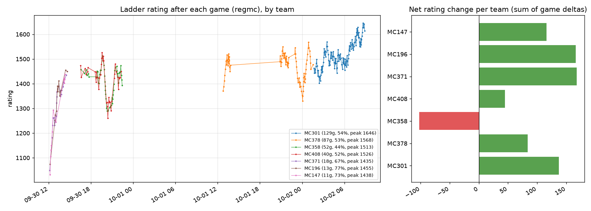

# ai-vgc

A bot for Pokémon VGC doubles (Gen 9 Champions, Reg M-A/B/C) on Pokémon Showdown. It is a neural
network trained on human replays, improved by self-play RL, with a one-turn search at play time. `docs/training-ideas.md` is the
running log of every experiment and its results.

## Setup

```bash
uv sync --extra nn    # includes torch
```

Trained checkpoints are published as a GitHub release (see `data/models/README.md` for what
each one is):

```bash
scripts/get_models.sh          # models in use
scripts/get_models.sh --all    # plus retired models, for benchmarks
```

`pokemon-showdown/` (Reg M-B) and `pokemon-showdown-mc/` (Reg M-C) are Showdown checkouts. Local
games start a server on `--port` if none is running; the search bridge (`nn/sim_bridge.js`) also
uses them.

## Data

| Path | What |
|---|---|
| `data/battle_logs/logs_<format>.json` | Human replays, `{battle_id: [uploadtime, log]}` (the vgc-battle-logs layout). Reg M-A/M-B Bo3: from the dataset published with [vgc-bench](https://github.com/cameronangliss/vgc-bench). Reg M-C Bo3 and Bo1: scraped from replay.pokemonshowdown.com with `ai_vgc.scrape_replays`. |
| `data/nn*/` | Training arrays built from those logs (`ai_vgc.nn.dataset`); `data/nn_ser` has Bo3 series context, `data/nn_cts` closed team sheets. |
| `data/teams/` | Team pools (Showdown export, one file per team): `reg_mb`, `reg_mc`, `reg_mc_top` (best 10 by `team_rank`), `mc196`. Also `set_usage_<format>.json` (sets from open team sheets, `scripts/set_usage.py`) and `munchstats_doubles.json` (stat point spreads, natures and usage from [MunchStats](https://www.munchstats.com/champions/doubles/), `ai_vgc.munchstats`, refreshed by the ladder bot), which search uses to guess hidden sets. |
| `data/models/` | Checkpoints, named `<reg>-<format>-<method>-v<N>` (see `data/models/README.md`; retired ones in `archive/`). Current best: `mc-bo3-rnad-v5.pt`; `all-bo3-opp-v2.pt` is the opponent model search uses. |
| `data/live_games/<date>/` | The ladder bot's games: replays plus `games.jsonl` (result, team, account, full log). |
| `data/bot_logs/` | The same games in the battle_logs layout, kept apart from the human data. |

Scrape more replays (resumable; one process per format):

```bash
uv run python -m ai_vgc.scrape_replays --format gen9championsvgc2026regmc
```

## Neural network pipeline (`src/ai_vgc/nn`)

1. **Dataset:** `dataset.py` replays each log from both players' views and stores every decision
   (`encode.py` turns a battle into tensors). `--closed` hides the opponent's team sheet.
2. **Imitation:** `train.py` trains the transformer policy + value head (`model.py`);
   `--series` adds Bo3 context, `--aux-coef` an opponent-action head.
3. **RL:** `rl.py` is PPO self-play with a KL anchor, double oracle (`--mix nash`) and R-NaD
   (`--reg-every`); `--my-team` specialises on one team, `--closed-sheets` plays CTS.
4. **Play:** `player.py` plays local matches, evaluations and the Showdown ladder; `--search`
   adds `search.py`, a one-turn lookahead run in Showdown's own simulator.
5. **Teams:** `team_test.py`, `team_rank.py` and `team_rr.py` (specialist round robin) rate teams.

Long jobs (dataset builds, training, RL, large evaluations) have Slurm batch scripts in
`scripts/slurm/`; each script's header shows its usage, and logs go to `logs/`.

## Playing on Showdown

`scripts/bot.sh` wraps `player.py` for the laptop:

```bash
scripts/bot.sh --ladder --top 3 --model data/models/mc-bo3-rnad-v5.pt --watch   # ladder, random top-3 team
scripts/bot.sh --ladder --gauntlet                                         # knock out weak teams on the ladder
scripts/bot.sh --ladder --cts --model data/models/mc-cts-rnad-v6.pt             # Bo1, closed team sheets
BOT=nimnimbot2 scripts/bot.sh --accept --top 3                             # take challenges (second account)
```

`scripts/bot.sh --help` lists every option. Summaries of the saved games: `scripts/bo3_sum.py`,
`scripts/team_sum.py`, `scripts/opp_habits.py`.

### Ladder results

Reg M-C CTS Bo1 ladder rating after each game, by team (`uv run --extra viz python scripts/ladder_plot.py`):



Commands behind it (CTS Bo1, Reg M-C, one-turn search; each team with its own v7 specialist model):

```bash
# MC301 (Sun + Trick Room): best so far, peak 1646
scripts/bot.sh --ladder --cts --use MC301 --model data/models/mc-cts-rnad-v7-MC301.pt --opp-model data/models/mc-cts-opp-v6.pt
# MC378 (rain): peak 1568
scripts/bot.sh --ladder --cts --use MC378 --model data/models/mc-cts-rnad-v7-MC378.pt --opp-model data/models/mc-cts-opp-v6.pt
```

The earlier teams (MC147, MC196, MC358, MC371, MC408) were laddered with the general model
(`mc-cts-rnad-v6.pt`) and `--use <team>` / `--top`; the games record the team and, since Oct 1, the model.
